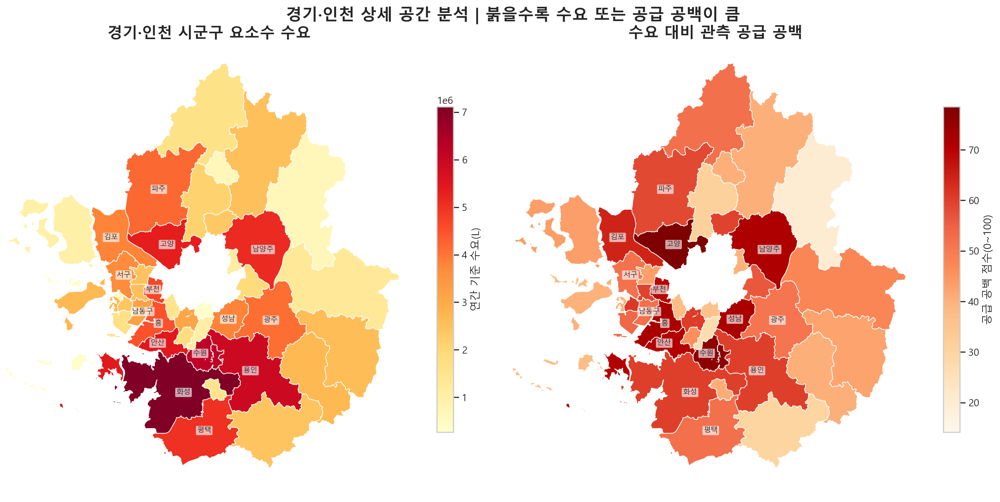
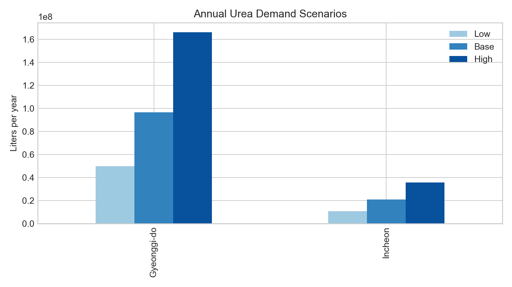
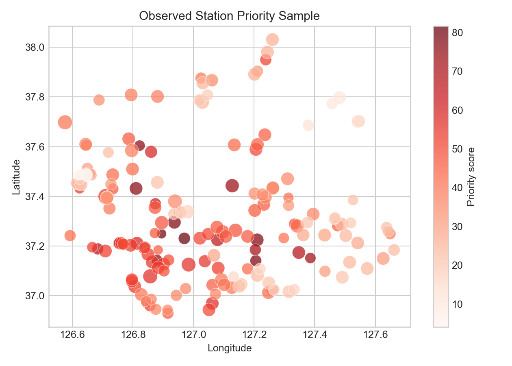
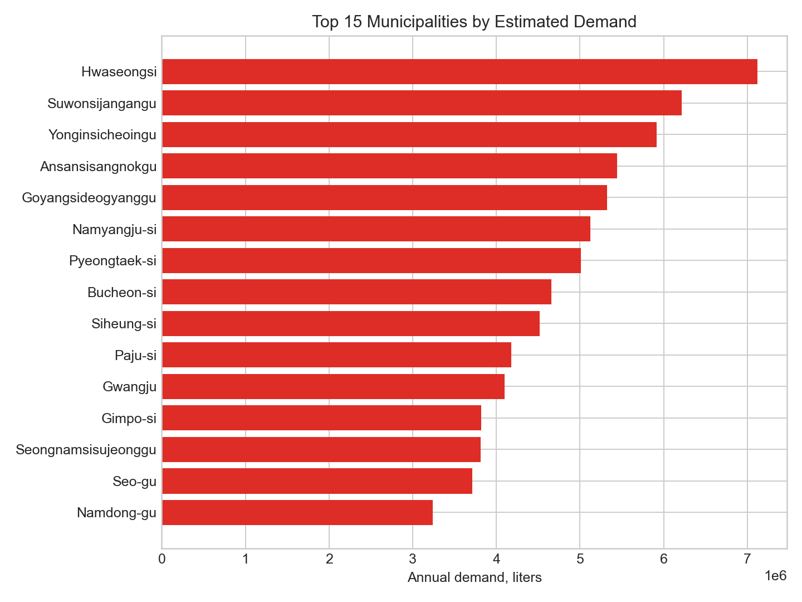
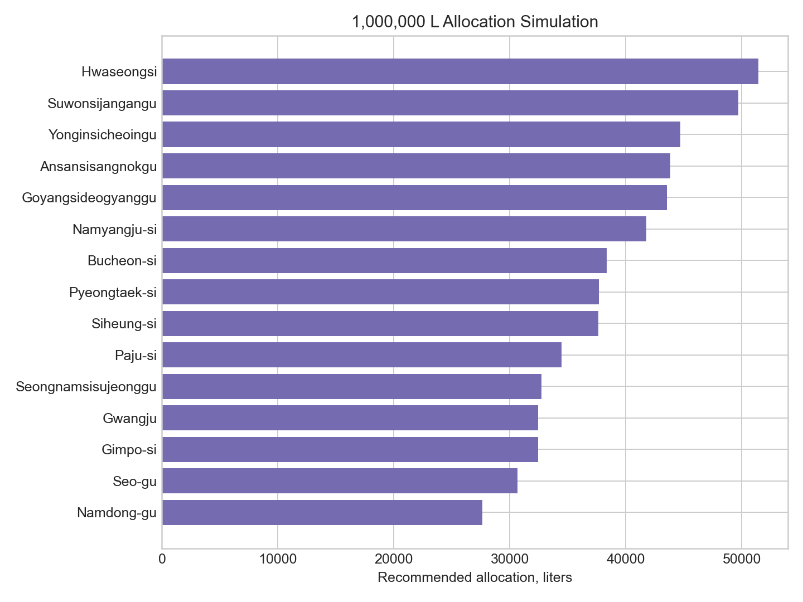

# BigdataCampus

Public portfolio archive for the **Eardream School first team project experience**.

This repository documents how a messy classroom dataset was turned into a public-safe, reproducible, and presentation-ready analysis package.

## Featured project

### Urea Supply Map Analysis

Regional emergency supply planning analysis for a 2021 urea inventory sample.

The original station dataset looked nationwide at first glance, but the usable observations were heavily concentrated in **Gyeonggi-do** and **Incheon**. Instead of forcing a misleading national ranking, this project reframes the analysis as a regional demand, inventory, safety-stock, and allocation problem.

[Open the project README](urea-supply-map-analysis/README.md)  
[Open the notebook](urea-supply-map-analysis/notebooks/urea_supply_map_analysis.ipynb)  
[Browse processed data](urea-supply-map-analysis/data/processed/)  
[Read the project experience note](docs/project_experience.md)

## Visual preview



| Demand scenarios | Station priority sample |
|---|---|
|  |  |

| Municipality demand | Allocation simulation |
|---|---|
|  |  |

## What this repository highlights

| Area | What was improved |
|---|---|
| Data scope | Removed misleading nationwide interpretation and limited the analysis to Gyeonggi-do and Incheon |
| Data quality | Rebuilt public CSV files with English column names and clean file paths |
| Privacy hygiene | Removed station names, street addresses, phone numbers, instructor PDFs, and original classroom notebooks |
| Reproducibility | Kept a compact notebook, processed CSV files, and an asset preparation script |
| Communication | Added charts, map imagery, and a project narrative suitable for portfolio review |

## Repository structure

```text
docs/
  project_experience.md

urea-supply-map-analysis/
  data/
    boundaries/
    processed/
  figures/
  notebooks/
  src/
```

## Project snapshot

- Provinces analyzed: 2
- Municipalities analyzed: 41
- Public-safe station records: 178
- Allocation simulation volume: 1,000,000 L
- Main operating metric: inventory cover days against estimated daily demand

## Note

This is a learning and portfolio repository. The data products are intentionally scoped and anonymized so the analysis can be shared publicly without overstating coverage or exposing raw station information.
